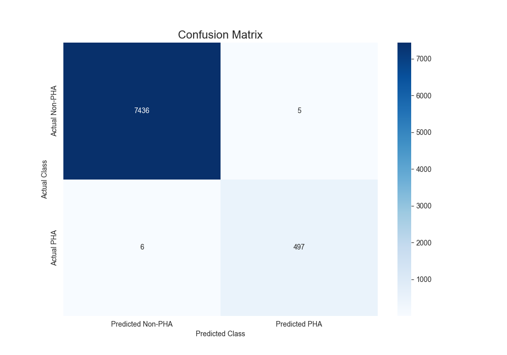

# 🚀 Astro-Classifier RF: Potentially Hazardous Asteroid Classification


This project uses a **Random Forest** Machine Learning model to classify asteroids as "Potentially Hazardous" (PHA) or not, based on orbital and physical data from the NASA JPL database.

The project includes a full data science workflow (acquisition, cleaning, EDA, training) and an **interactive Streamlit web application** to explore the model and live NASA data.

---

## 🚀 Interactive Web Application

This repository includes a web app (`app.py`) built with Streamlit. It provides two main features:

1.  **🛰️ Live Threat Monitor:** Connects to NASA's CNEOS API to display a real-time dashboard of upcoming asteroid close approaches (within the next 60 days).
2.  **🔬 AI Risk Simulator:** Allows you to interact directly with our trained Random Forest model. You can adjust the 6 key orbital parameters (like `H` and `moid`) to see how the model classifies the risk in real-time.


---

## 💻 Installation and Running the App

This project uses `Python 3.10`, and a virtual environment is recommended.

1.  **Clone the repository:**
    ```bash
    git clone [https://github.com/](https://github.com/)[YOUR_USERNAME]/[YOUR_PROJECT_NAME].git
    cd [YOUR_PROJECT_NAME]
    ```

2.  **Create and activate a virtual environment:**
    ```bash
    python -m venv venv
    source venv/bin/activate  # On Windows: .\venv\Scripts\activate
    ```

3.  **Install dependencies:**
    ```bash
    pip install -r requirements.txt
    ```

4.  **Run the Streamlit App:**
    ```bash
    streamlit run app.py
    ```

---

## 🎯 Objective and Scientific Discovery

The goal of this project was threefold:
1.  **AI:** Implement a Scikit-learn `RandomForestClassifier` on a real-world classification problem.
2.  **Portfolio:** Build an end-to-end data science project, from notebook to a live web application.
3.  **Science:** Not only predict PHA status but also **understand what defines the risk**.

### 1. Model Performance: 99.86% Accuracy

The final model, trained on 80% of the data and tested on 20% of unseen data, achieved an overall accuracy of 99.86%.

The most critical metric is the **Recall** for PHAs: **our model successfully identified 98.8% of all real threats (497 out of 503)** in the test set, with an extremely low number of false alarms (5) and missed threats (6).



### 2. The Discovery: The Model "Rediscovered" Risk

The scientific objective was successfully met. By asking the model which features it found most important, it **autonomously confirmed the astrophysical definition of risk.**

The model identified that "danger" is a combination of two primary factors:
1.  **`H` (Magnitude/Size):** The most important factor by a large margin. The model learned that the object's size is the main indicator of risk.
2.  **`moid` (Proximity):** The second-most important factor. The model learned that the minimum orbital intersection distance with Earth is the other key indicator.

The model didn't just learn to *classify*; it learned to *evaluate risk* based on **Size** and **Proximity**.


---

### 🚀 Model Usage (Inputs)

The trained model (`rf_pha_classifier.joblib`) is ready to make predictions. To use it (via the `app.py` Streamlit app), you must provide the following **6 features**:

* **`H`** (Absolute Magnitude): *Proxy for the object's size.*
* **`e`** (Eccentricity): *The shape of the orbit (0=perfect circle).*
* **`a`** (Semi-Major Axis): *The average size of the orbit.*
* **`q`** (Perihelion Distance): *The orbit's closest point to the Sun.*
* **`i`** (Inclination): *The orbit's angle relative to Earth's orbit.*
* **`moid`** (Earth MOID): *The minimum distance between the object's orbit and Earth's orbit.*

---

## 📖 Process (The Notebooks)

The project is divided into three sequential notebooks located in the `/notebooks/` directory:

* **`01_Data_Acquisition_and_Cleaning.ipynb`**
    * Queries the NASA JPL Small-Body Database.
    * Filters to get all Near-Earth Objects (NEOs).
    * Cleans the data: handles `NaN` values and converts the `pha` target to binary (0/1).
    * Saves a clean `asteroids_cleaned.csv` file.

* **`02_Exploratory_Data_Analysis.ipynb`**
    * Analyzes the class imbalance (the vast majority of objects are non-hazardous).
    * Visualizes feature distributions (`H`, `moid`, etc.).
    * Generates a correlation matrix to identify relationships between variables.

* **`03_Model_Training_and_Evaluation.ipynb`**
    * Splits the data into training (80%) and testing (20%) sets.
    * Trains a `RandomForestClassifier` using `class_weight='balanced'` to handle the imbalance.
    * Evaluates the model, generating the confusion matrix and classification report.
    * Extracts and plots feature importances.
    * Saves the final trained model to `/results/models/`.

---

## 🗂️ Repository Structure

```bash
astro-classifier-rf/
|
+-- .gitignore
+-- LICENSE
+-- README.md
+-- app.py                  
+-- requirements.txt
|
+-- data/
|   +-- raw/
|   |   \-- .gitkeep
|   \-- processed/
|       \-- .gitkeep
|
+-- notebooks/
|   +-- 01_Data_Acquisition_and_Cleaning.ipynb
|   +-- 02_Exploratory_Data_Analysis.ipynb
|   \-- 03_Model_Training_and_Evaluation.ipynb
|
+-- results/
    +-- figures/
    |   +-- 01_class_distribution.png
    |   +-- ... (other plots) ...
    |   +-- 05_feature_importance.png
    |   \-- app_monitor.png 
    \-- models/
        \-- rf_pha_classifier.joblib
````
## 📄 License
This project is released under the MIT License.